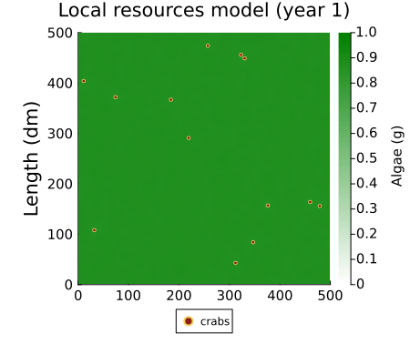
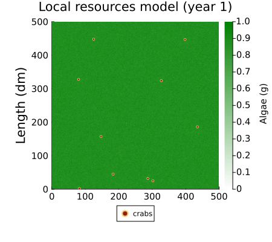
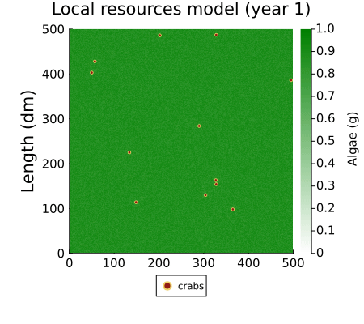

# TFM-Invasion_and_impact_of_Percnon_gibbesi
Repository containing all the code and images produced for my master's thesis.

Programs needed: Jupyter notebooks, Julia

# Animations

NPP = 0.14 & epsilon = 0.35

NPP = 0.18 & epsilon = 0.7

NPP = 0.23 & epsilon = 0.07

NPP = 0.28 & epsilon = 0.014

NPP = 0.32 & epsilon = 0.007

